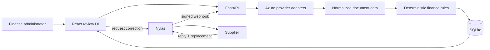

# Target architecture

Invoice Review will be built as a small local full-stack application. The learner starter intentionally contains only a FastAPI health endpoint and a React landing screen.

## Intended boundaries

- Provider adapters normalize Azure responses before data reaches the domain.
- Deterministic invoice and receipt rules remain separate from model extraction.
- Routes own HTTP concerns, a service owns orchestration, and a repository owns SQLite access.
- Environment values are read through one backend settings module and one frontend environment module.
- A person approves, rejects, or requests a supplier correction after seeing evidence and uncertainty.
- Nylas sends a requested correction from Maya's configured mailbox. Signed replies on that
  known thread may contribute one replacement attachment, which re-enters the same pipeline.

## Target flow

## Starter checkpoint

The backend exposes `GET /health`, the frontend renders the starter screen, the fictional corpus is available under `samples/`, and no completed review workflow exists on `main`.
