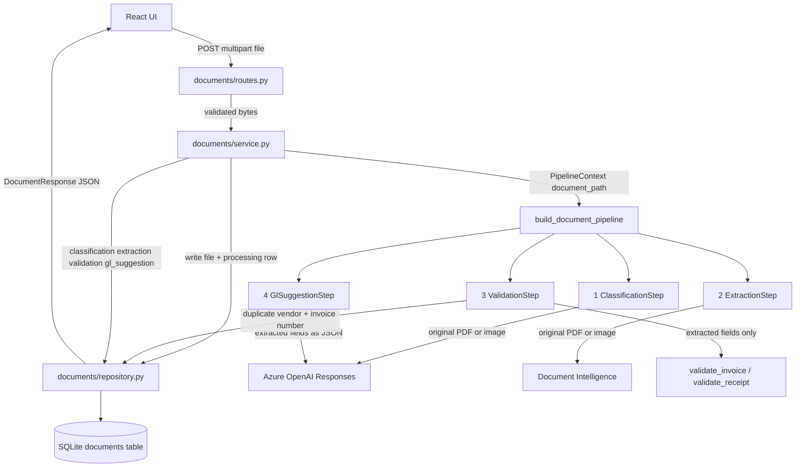
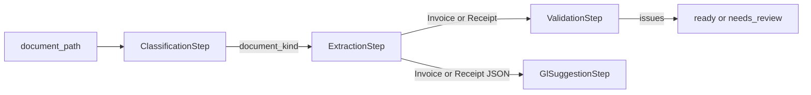

# How Invoice Review works

When you click **Process document**, the browser does not run classification, extraction, or
GL suggestion itself. It posts the file to FastAPI. FastAPI saves the file, runs one shared
pipeline, stores the result in SQLite, and returns that result as JSON. The result page is just
that JSON rendered.

This document explains the HTTP surface, the four pipeline steps, and how those two layers
meet. Corrections, approval, rejection, and correction-email drafts are not in this build yet.

## The shape of the system

Three layers stay separate on purpose:

- **Routes** parse HTTP, reject bad files, and map errors to status codes.
- **Service** owns the upload workflow: write the file, run the pipeline, persist the outcome.
- **Pipeline** owns the document work: classify → extract → validate → suggest a GL account.

SQLite and the local upload folder are persistence. Azure is only reached from provider
adapters and the two OpenAI steps. Northstar policy is ordinary Python in
`backend/app/invoices/validation.py`.



The playground script `playground/process_sample_document.py` calls the same
`build_document_pipeline()`. HTTP did not invent a second pipeline; it wrapped the one you
already ran interactively.

## What happens when you process a document

The UI currently uses one endpoint for the whole review:

`POST /api/documents`

1. `UploadStep` keeps the chosen PDF, JPEG, or PNG in browser memory and previews it locally.
2. **Process document** calls `uploadDocument()` in `frontend/src/lib/document-api.ts`.
3. The request is `multipart/form-data` with one field named `file`, sent to
   `VITE_API_BASE_URL` (`http://localhost:8000`).
4. `ProcessingStep` is a waiting screen. The API call is synchronous: the browser sits on that
   one POST until the pipeline finishes.
5. FastAPI rejects empty files, files over 4 MB, and anything that is not PDF/JPEG/PNG **before**
   Azure is called.
6. `DocumentService.process()` writes `backend/data/uploads/{id}.pdf` (or `.jpg` / `.png`) and
   inserts a SQLite row with `status: "processing"`.
7. It runs `build_document_pipeline(duplicate_registry=self.repository).run(...)`.
8. On success it overwrites the row with classification, extraction, validation, GL suggestion,
   and a final status: `needs_review` if any validation issue is an error, otherwise `ready`.
   Warnings such as a missing purchase order do not block `ready`.
9. On a pipeline or Azure failure it stores `status: "failed"` plus `error_message` and the
   route returns HTTP 502.
10. `DocumentResult` renders the JSON. History, editing, and approval are still placeholders.

One successful upload spends three Azure calls: one OpenAI classification of the original
file, one Document Intelligence page (`prebuilt-invoice` or `prebuilt-receipt`), and one OpenAI
GL suggestion over the extracted fields.

## HTTP endpoints

All of these are registered in `backend/app/main.py`. CORS allows only
`ALLOWED_ORIGIN` from `backend/.env` (default `http://localhost:5173`).

| Method | Path | What it does | UI uses it today |
| --- | --- | --- | --- |
| `GET` | `/health` | Liveness check. Does not touch Azure or SQLite. | No |
| `POST` | `/api/documents` | Upload one file, run the pipeline, persist and return the review. | Yes |
| `GET` | `/api/documents` | List saved reviews, newest first. | No (history is a stub) |
| `GET` | `/api/documents/{id}` | Fetch one saved review. | No |
| `DELETE` | `/api/documents/{id}` | Delete the SQLite row and the stored file. | No |
| `GET` | `/api/accounting/gl-accounts` | Return the ten fixed Northstar GL accounts. | No |

They do not call each other. Upload is the write path. List/get/delete are read or cleanup
around the same `documents` table. The GL catalog is a separate read-only policy surface: it
does not run the pipeline.

### `GET /health`

Returns `{"status":"ok"}`. Useful to confirm uvicorn is up. The React app does not call it.

### `POST /api/documents`

This is the endpoint you just used.

**Request:** multipart file. Allowed types: `application/pdf`, `image/jpeg`, `image/png`.
Maximum size: 4 MB (`AppConfig.max_upload_bytes`).

**Local rejections (no Azure):**

| HTTP | When |
| --- | --- |
| 415 | Content type is not PDF, JPEG, or PNG |
| 422 | File is empty |
| 413 | File is larger than 4 MB |

**Success:** `201` with a `DocumentResponse`. The body is the persisted review, not a job id.
The pipeline has already finished.

**Pipeline failure:** `502` with FastAPI `detail` set to the error message. The row still exists
as `failed`, so a later history view can show it. The uploaded file remains on disk.

**Response shape** (same model as get/list):

```json
{
  "id": "uuid",
  "original_filename": "01-en-happy-classic.pdf",
  "content_type": "application/pdf",
  "status": "ready",
  "classification": { "document_kind": "invoice", "confidence": 0.9, "reasoning": "..." },
  "extraction": { "invoice": { "...": "..." }, "receipt": null },
  "validation": { "issues": [] },
  "gl_suggestion": {
    "account_code": "6100",
    "account_name": "Cleaning services",
    "confidence": 0.8,
    "reasoning": "..."
  },
  "error_message": null,
  "created_at": "...",
  "updated_at": "..."
}
```

`extraction` always has both slots. An invoice fills `invoice` and leaves `receipt` null; a
receipt does the reverse. The result page picks the slot that matches `classification.document_kind`.

Statuses:

| Status | Meaning |
| --- | --- |
| `processing` | Row created; pipeline still running. You will not normally see this in the UI because the POST blocks until the pipeline returns. |
| `ready` | Pipeline finished; validation has no errors. |
| `needs_review` | Pipeline finished; at least one validation **error** (not merely a warning). |
| `failed` | Pipeline or Azure raised; `error_message` is set. |

### `GET /api/documents`

Returns every row in `documents`, newest first. Each item is the same `DocumentResponse` as
upload. The History screen does not call this yet.

### `GET /api/documents/{id}`

Returns one review or `404`. Same JSON as the upload response for that id.

### `DELETE /api/documents/{id}`

Removes the SQLite row and `backend/data/uploads/{stored_filename}`. Returns `204`. `404` if
the id does not exist. This is how a demo can forget an invoice and upload it again without a
duplicate hit.

### `GET /api/accounting/gl-accounts`

Returns the ten accounts from `backend/app/accounting/catalog.py` (`6100`–`6190`). The catalog
is code, not a database table. The GL suggestion step already uses this catalog internally via
`resolve_account()`; this endpoint exists so a later reviewer UI can show the same list and let
Maya override the suggestion. The current result page only displays the suggestion that came
back on `POST /api/documents`.

## How the HTTP layer is wired

```text
create_app()
  ├── GET /health                         main.py
  ├── /api/documents/*                    documents/routes.py
  │     ├── Depends: SQLAlchemy session → DocumentRepository
  │     ├── POST → DocumentService.process()
  │     ├── GET "" → repository.list()
  │     ├── GET /{id} → DocumentService.get()
  │     └── DELETE /{id} → DocumentService.delete()
  └── /api/accounting/gl-accounts         accounting/routes.py
        └── GL_ACCOUNTS tuple
```

`DocumentService.process()` is the only place HTTP meets the pipeline:

1. Allocate a UUID and store the bytes under `upload_dir`.
2. `repository.create_processing(...)` so a crash still leaves a row.
3. `build_document_pipeline(duplicate_registry=self.repository).run(PipelineContext(document_path=...))`.
4. Map validation issues to `ready` / `needs_review`.
5. `repository.save_result(...)` writes the four pipeline slots as JSON columns, plus
   `vendor_name` and `invoice_number` for duplicate lookup on later invoices.

The repository implements `DuplicateRegistry.is_registered()`. Validation therefore asks SQLite
“have we already stored this vendor + invoice number?” without importing SQLAlchemy into the
policy module.

## The pipeline

The pipeline is a list of steps that each take a `PipelineContext` and return an updated copy.
Nothing in the pipeline knows about FastAPI or React.

```python
PipelineContext(
    document_path,      # the only input at the start
    classification,     # filled by step 1
    extraction,         # filled by step 2
    validation,         # filled by step 3
    gl_suggestion,      # filled by step 4
)
```

`build_document_pipeline()` in `backend/app/pipeline/__init__.py` always runs this order:

```text
ClassificationStep → ExtractionStep → ValidationStep → GlSuggestionStep
```

Each step refuses to run unless the previous slots it needs are present. That is the
connection: later steps read earlier fields on the same context object, not other HTTP
endpoints.



### 1. Classification

**Module:** `backend/app/pipeline/classification.py`

Sends the **original file** to Azure OpenAI Responses with a strict `DocumentClassification`
schema: `document_kind` (`invoice` or `receipt`), `confidence`, `reasoning`.

That label is the switch for every later step. Extraction does not guess the Azure model; it
uses `prebuilt-invoice` or `prebuilt-receipt` according to this result.

### 2. Extraction

**Module:** `backend/app/pipeline/extraction.py`

Reads `ctx.classification.document_kind` and calls `DocumentIntelligenceService`:

- invoice → `analyze_invoice()` → Azure `prebuilt-invoice` → `Invoice`
- receipt → `analyze_receipt()` → Azure `prebuilt-receipt` → `Receipt`

Azure SDK types stop in `backend/app/providers/azure_document_intelligence.py`. The rest of
the app only sees the Pydantic models in `backend/app/schemas/`.

Invoice fields include vendor/customer identity and VAT IDs, invoice number and dates, PO,
currency, totals, line items, and extraction confidence. Receipt fields include merchant,
transaction date/time, expense category, currency, totals, line items, and confidence.

### 3. Validation

**Module:** `backend/app/pipeline/validation.py`

No Azure. It runs Northstar policy on the **extracted** invoice or receipt:

- invoices → `validate_invoice()`
- receipts → `validate_receipt()`

Invoice errors include missing identity, missing or malformed supplier VAT, customer VAT that
does not match Northstar (`NL123456789B01`), missing number/date/total/currency, non-positive
total, due date before invoice date, totals off by more than EUR 0.01, and a duplicate vendor +
invoice number already stored in SQLite. Missing PO and primary confidence below 0.80 are
warnings.

Receipts do not require invoice number, customer VAT, PO, or due date. Merchant, transaction
date, currency, positive total, and VAT total are required. Subtotal + VAT must match total
within EUR 0.01 when all three are present.

The step writes `ctx.validation.issues`. It does not decide `ready` vs `needs_review`;
`DocumentService.status_for_issues()` does that after the pipeline returns. The playground
prints issues and does not assign an HTTP status.

### 4. GL suggestion

**Module:** `backend/app/pipeline/gl_suggestion.py`

Sends `invoice.model_dump_json()` or `receipt.model_dump_json()` to Azure OpenAI — **not** the
PDF. The model must pick one code from the catalog (`6100`–`6190`). `resolve_account()` then
loads the canonical name from `GL_ACCOUNTS`. Unknown codes cannot leak into the saved review.

The suggestion is a hint. This slice does not yet let Maya change it or require a selected
account for approval.

## How a document kind flows through the whole stack

An English cleaning invoice and a Dutch fuel receipt share the same HTTP path and the same
pipeline object. Only the context slots differ:

| Slot | Invoice | Receipt |
| --- | --- | --- |
| `classification.document_kind` | `invoice` | `receipt` |
| Document Intelligence model | `prebuilt-invoice` | `prebuilt-receipt` |
| `extraction.invoice` | filled | `null` |
| `extraction.receipt` | `null` | filled |
| Policy function | `validate_invoice` | `validate_receipt` |
| Duplicate check | vendor + invoice number in SQLite | not used |
| GL prompt input | invoice JSON | receipt JSON |

That is why the result page can share one summary (kind, party, date, total) while still
showing invoice-only or receipt-only fields.

## What is intentionally not connected yet

The backend already has list/get/delete and the GL catalog HTTP, but the React app only
implements welcome → upload → process → read-only result. History is a stub. There is no
approve/reject, no field editing, no GL override, and no correction-email draft. Those will
call new endpoints (or extend these) in later slices; they should not be folded into the
pipeline steps that already exist.
