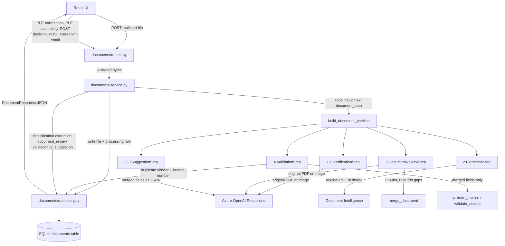
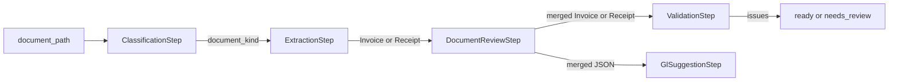

# How Invoice Review works

When you click **Process document**, the browser does not run classification, extraction, or
GL suggestion itself. It posts the file to FastAPI. FastAPI saves the file, runs one shared
pipeline, stores the result in SQLite, and returns that result as JSON. The result page is just
that JSON rendered.

This document explains the HTTP surface, the five pipeline steps, and how those two layers
meet, then the human loop on top: corrections, GL selection, approve/reject, a drafted (never
sent) correction email, and history with deletion.

## The shape of the system

Three layers stay separate on purpose:

- **Routes** parse HTTP, reject bad files, and map errors to status codes.
- **Service** owns the workflow: write the file, run the pipeline, persist the outcome, and
  apply the review rules (edit → re-validate, approve only without errors, decided rows freeze).
- **Pipeline** owns the document work: classify → extract → LLM review → validate → suggest a
  GL account.

SQLite and the local upload folder are persistence. Azure is only reached from provider
adapters. Plurobi policy is ordinary Python in `backend/app/invoices/validation.py`.



The playground script `playground/process_sample_document.py` calls the same
`build_document_pipeline()`. HTTP did not invent a second pipeline; it wrapped the one you
already ran interactively.

## What happens when you process a document

Upload is one endpoint:

`POST /api/documents`

1. `UploadStep` keeps the chosen PDF, JPEG, or PNG in browser memory and previews it locally.
2. **Process document** calls `uploadDocument()` in `frontend/src/lib/document-api.ts`.
3. The request is `multipart/form-data` with one field named `file`, sent to
   `VITE_API_BASE_URL` (`http://localhost:8000`).
4. `ProcessingStep` is a waiting screen listing the five stages. The API call is synchronous:
   the browser sits on that one POST until the pipeline finishes.
5. FastAPI rejects empty files, files over 4 MB, and anything that is not PDF/JPEG/PNG **before**
   Azure is called.
6. `DocumentService.process()` writes `backend/data/uploads/{id}.pdf` (or `.jpg` / `.png`) and
   inserts a SQLite row with `status: "processing"`.
7. It runs `build_document_pipeline(duplicate_registry=self.repository).run(...)`.
8. On success it overwrites the row with classification, extraction (merged, with
   `field_sources`), `document_review`, validation, GL suggestion, a default
   `selected_gl_account_code` equal to the suggestion, and a final status: `needs_review` if any
   validation issue is an error, otherwise `ready`. Warnings such as a missing purchase order do
   not block `ready`.
9. On a pipeline or Azure failure it stores `status: "failed"` plus `error_message` and the
   route returns HTTP 502. If only the LLM reviewer fails, the upload still succeeds and
   `document_review.error_message` explains why the cross-check is missing.
10. `DocumentReview` renders the JSON as an editable review page (see below).

One successful upload spends four Azure calls: one OpenAI classification of the original file,
one Document Intelligence page (`prebuilt-invoice` or `prebuilt-receipt`), one OpenAI independent
review of the original file, and one OpenAI GL suggestion over the merged fields.

## HTTP endpoints

All of these are registered in `backend/app/main.py`. CORS allows only
`ALLOWED_ORIGIN` from `backend/.env` (default `http://localhost:5173`).

| Method | Path | What it does | Azure |
| --- | --- | --- | --- |
| `GET` | `/health` | Liveness check. Does not touch Azure or SQLite. | No |
| `POST` | `/api/documents` | Upload one file, run the pipeline, persist and return the review. | Yes |
| `GET` | `/api/documents` | List saved reviews, newest first (History screen). | No |
| `GET` | `/api/documents/{id}` | Fetch one saved review (reopen from History). | No |
| `GET` | `/api/documents/{id}/file` | Stream the stored PDF/PNG/JPEG inline for the preview. | No |
| `PUT` | `/api/documents/{id}` | Apply field corrections, mark them `human`, re-run policy. | No |
| `PUT` | `/api/documents/{id}/accounting` | Persist Maya's selected GL account (`resolve_account()`). | No |
| `POST` | `/api/documents/{id}/decision` | `approved` or `rejected`. Approve needs no errors + a GL account. | No |
| `POST` | `/api/documents/{id}/correction-email` | Draft a supplier email for supplier-fixable errors. Not stored, not sent. | Yes (1 OpenAI) |
| `DELETE` | `/api/documents/{id}` | Delete the SQLite row and the stored file. | No |
| `GET` | `/api/accounting/gl-accounts` | Return the ten fixed Plurobi GL accounts. | No |

Upload is the only path that runs the pipeline. The review endpoints work on the stored row:
they re-run `validate_invoice` / `validate_receipt` directly, never Document Intelligence or
the LLM reviewer. Once a row is `approved` or `rejected`, every mutating endpoint except
`DELETE` returns `409`.

### `GET /health`

Returns `{"status":"ok"}`. Useful to confirm uvicorn is up. The React app does not call it.

### `POST /api/documents`

This is the endpoint you just used.

**Request:** multipart file. Allowed types: `application/pdf`, `image/jpeg`, `image/png`.
Maximum size: 4 MB (`AppConfig.max_upload_bytes`).

**Local rejections (no Azure):**

| HTTP | When |
| --- | --- |
| 415 | Content type is not PDF, JPEG, or PNG |
| 422 | File is empty |
| 413 | File is larger than 4 MB |

**Success:** `201` with a `DocumentResponse`. The body is the persisted review, not a job id.
The pipeline has already finished.

**Pipeline failure:** `502` with FastAPI `detail` set to the error message. The row still exists
as `failed`, so a later history view can show it. The uploaded file remains on disk.

**Response shape** (same model as get/list):

```json
{
  "id": "uuid",
  "original_filename": "01-en-happy-classic.pdf",
  "content_type": "application/pdf",
  "status": "ready",
  "classification": { "document_kind": "invoice", "confidence": 0.9, "reasoning": "..." },
  "extraction": { "invoice": { "...": "..." }, "receipt": null },
  "validation": { "issues": [] },
  "gl_suggestion": {
    "account_code": "6100",
    "account_name": "Cleaning services",
    "confidence": 0.8,
    "reasoning": "..."
  },
  "error_message": null,
  "created_at": "...",
  "updated_at": "..."
}
```

`extraction` always has both slots. An invoice fills `invoice` and leaves `receipt` null; a
receipt does the reverse. The result page picks the slot that matches `classification.document_kind`.

Statuses:

| Status | Meaning |
| --- | --- |
| `processing` | Row created; pipeline still running. You will not normally see this in the UI because the POST blocks until the pipeline returns. |
| `ready` | Pipeline finished; validation has no errors. |
| `needs_review` | Pipeline finished; at least one validation **error** (not merely a warning). |
| `approved` | Maya approved. No errors remained and a GL account was selected. Immutable. |
| `rejected` | Maya rejected. Immutable. |
| `failed` | Pipeline or Azure raised; `error_message` is set. |

`extraction.field_sources` maps each scalar field to `document_intelligence`, `llm_fallback`, or
`human`. `document_review` holds the LLM's own reading, per-field comparisons (`match`,
`different`, `missing_in_llm`, `missing_in_document_intelligence`, `missing_in_both`), the list
of fields the LLM filled, and an `error_message` when the secondary reviewer was unavailable.

### `GET /api/documents`

Returns every row in `documents`, newest first. Each item is the same `DocumentResponse` as
upload. The History screen renders this list and opens one row with `GET /api/documents/{id}`
plus `GET /api/documents/{id}/file` for the preview.

### `GET /api/documents/{id}`

Returns one review or `404`. Same JSON as the upload response for that id.

### `DELETE /api/documents/{id}`

Removes the SQLite row and `backend/data/uploads/{stored_filename}`. Returns `204`. `404` if
the id does not exist. This is how a demo can forget an invoice and upload it again without a
duplicate hit.

### `GET /api/accounting/gl-accounts`

Returns the ten accounts from `backend/app/accounting/catalog.py` (`6100`–`6190`). The catalog
is code, not a database table. The review page loads it once to populate the GL selector; the
GL suggestion step and `PUT /api/documents/{id}/accounting` both go through `resolve_account()`
so an unknown code can never be saved.

### Review endpoints

`PUT /api/documents/{id}` takes `{"invoice": {...}}` or `{"receipt": {...}}` with only the
scalar fields Maya changed (`InvoiceCorrection` / `ReceiptCorrection`, `extra="forbid"`). The
service copies the stored `Invoice`/`Receipt`, applies the changes, marks changed fields
`human` in `field_sources`, re-runs the matching policy function, and recomputes `ready` vs
`needs_review`. Duplicate lookup excludes the row itself, so re-saving an invoice never flags it
as its own duplicate.

`POST /api/documents/{id}/decision` enforces the brief: `rejected` is always allowed on an open
review; `approved` requires no `error` issues and a resolvable `selected_gl_account_code`.
Warnings never block approval.

`POST /api/documents/{id}/correction-email` filters the stored issues with
`supplier_fixable_issues()` (errors only, minus Plurobi-internal codes `duplicate_invoice` and
`low_extraction_confidence`). With nothing to write about it returns `409`. Otherwise it sends
the document fields and those issues to Azure OpenAI and returns `recipient_name`, `subject`,
`body`, and `issue_codes`. Nothing is persisted and nothing is sent.

## How the HTTP layer is wired

```text
create_app()
  ├── GET /health                         main.py
  ├── /api/documents/*                    documents/routes.py
  │     ├── Depends: SQLAlchemy session → DocumentRepository
  │     ├── POST → DocumentService.process()
  │     ├── GET "" → repository.list()
  │     ├── GET /{id} → DocumentService.get()
  │     ├── GET /{id}/file → FileResponse(service.stored_path())
  │     ├── PUT /{id} → DocumentService.correct()
  │     ├── PUT /{id}/accounting → DocumentService.select_gl_account()
  │     ├── POST /{id}/decision → DocumentService.decide()
  │     ├── POST /{id}/correction-email → DocumentService.draft_correction_email()
  │     └── DELETE /{id} → DocumentService.delete()
  └── /api/accounting/gl-accounts         accounting/routes.py
        └── GL_ACCOUNTS tuple
```

`DocumentService.process()` is the only place HTTP meets the pipeline:

1. Allocate a UUID and store the bytes under `upload_dir`.
2. `repository.create_processing(...)` so a crash still leaves a row.
3. `build_document_pipeline(duplicate_registry=self.repository).run(PipelineContext(document_path=...))`.
4. Map validation issues to `ready` / `needs_review`.
5. `repository.save_result(...)` writes the five pipeline slots as JSON columns, defaults
   `selected_gl_account_code` from the suggestion, and stores `vendor_name` and
   `invoice_number` for duplicate lookup on later invoices.

The repository implements `DuplicateRegistry.is_registered()`. Validation therefore asks SQLite
“have we already stored this vendor + invoice number?” without importing SQLAlchemy into the
policy module.

## The pipeline

The pipeline is a list of steps that each take a `PipelineContext` and return an updated copy.
Nothing in the pipeline knows about FastAPI or React.

```python
PipelineContext(
    document_path,      # the only input at the start
    classification,     # filled by step 1
    extraction,         # filled by step 2, merged + field_sources by step 3
    document_review,    # filled by step 3
    validation,         # filled by step 4
    gl_suggestion,      # filled by step 5
)
```

`build_document_pipeline()` in `backend/app/pipeline/__init__.py` always runs this order:

```text
ClassificationStep → ExtractionStep → DocumentReviewStep → ValidationStep → GlSuggestionStep
```

Each step refuses to run unless the previous slots it needs are present. That is the
connection: later steps read earlier fields on the same context object, not other HTTP
endpoints.



### 1. Classification

**Module:** `backend/app/pipeline/classification.py`

Sends the **original file** to Azure OpenAI Responses with a strict `DocumentClassification`
schema: `document_kind` (`invoice` or `receipt`), `confidence`, `reasoning`.

That label is the switch for every later step. Extraction does not guess the Azure model; it
uses `prebuilt-invoice` or `prebuilt-receipt` according to this result.

### 2. Extraction

**Module:** `backend/app/pipeline/extraction.py`

Reads `ctx.classification.document_kind` and calls `DocumentIntelligenceService`:

- invoice → `analyze_invoice()` → Azure `prebuilt-invoice` → `Invoice`
- receipt → `analyze_receipt()` → Azure `prebuilt-receipt` → `Receipt`

Azure SDK types stop in `backend/app/providers/azure_document_intelligence.py`. The rest of
the app only sees the Pydantic models in `backend/app/schemas/`.

Invoice fields include vendor/customer identity and VAT IDs, invoice number and dates, PO,
currency, totals, line items, and extraction confidence. Receipt fields include merchant,
transaction date/time, expense category, currency, totals, line items, and confidence.

### 3. Independent LLM review

**Module:** `backend/app/pipeline/document_review.py`, merge in
`backend/app/document_review/reconciliation.py`

Sends the **original file** to Azure OpenAI again with a strict `LlmDocumentExtraction`
schema: plain-string fields for party names, VAT IDs, numbers, dates, currency, and totals, plus
a one-sentence summary. The reviewer is deliberately blind: it never receives Document
Intelligence output, mapped JSON, or validation issues.

`merge_document()` then walks a fixed field list (`INVOICE_FIELDS` or `RECEIPT_FIELDS`):

- A present DI value always wins and is tagged `document_intelligence`.
- A missing DI value is filled from the LLM only if the string parses into the domain type
  (ISO date, decimal amount) and is tagged `llm_fallback`.
- Every field gets a comparison row with normalized matching (casefold text, alphanumeric-only
  identifiers, numeric decimals) so `NL 123456782B90` and `NL123456782B90` count as a match.

The LLM can therefore add a purchase order DI skipped, but it cannot “repair” an invalid VAT
number or a wrong total, which is what keeps the corpus errors intact. If the OpenAI call fails
or the model says `unsupported`, the step keeps the DI extraction, records
`document_review.error_message`, and lets the upload continue.

### 4. Validation

**Module:** `backend/app/pipeline/validation.py`

No Azure. It runs Plurobi policy on the **merged** invoice or receipt:

- invoices → `validate_invoice()`
- receipts → `validate_receipt()`

Invoice errors include missing identity, missing or malformed supplier VAT, customer VAT that
does not match Plurobi (`NL00449544B01`), missing number/date/total/currency, non-positive
total, due date before invoice date, totals off by more than EUR 0.01, and a duplicate vendor +
invoice number already stored in SQLite. Missing PO and primary confidence below 0.80 are
warnings.

Receipts do not require invoice number, customer VAT, PO, or due date. Merchant, transaction
date, currency, positive total, and VAT total are required. Subtotal + VAT must match total
within EUR 0.01 when all three are present.

The step writes `ctx.validation.issues`. It does not decide `ready` vs `needs_review`;
`status_for_issues()` in `documents/service.py` does that after the pipeline returns, and again
after every `PUT` correction. The playground prints issues and does not assign an HTTP status.

### 5. GL suggestion

**Module:** `backend/app/pipeline/gl_suggestion.py`

Sends `invoice.model_dump_json()` or `receipt.model_dump_json()` to Azure OpenAI — **not** the
PDF. The model must pick one code from the catalog (`6100`–`6190`). `resolve_account()` then
loads the canonical name from `GL_ACCOUNTS`. Unknown codes cannot leak into the saved review.

The suggestion is a hint. It becomes the default `selected_gl_account_code`; Maya can change
it from the GL selector, and approval requires a resolvable selected account.

## How a document kind flows through the whole stack

An English cleaning invoice and a Dutch fuel receipt share the same HTTP path and the same
pipeline object. Only the context slots differ:

| Slot | Invoice | Receipt |
| --- | --- | --- |
| `classification.document_kind` | `invoice` | `receipt` |
| Document Intelligence model | `prebuilt-invoice` | `prebuilt-receipt` |
| `extraction.invoice` | filled | `null` |
| `extraction.receipt` | `null` | filled |
| Policy function | `validate_invoice` | `validate_receipt` |
| Duplicate check | vendor + invoice number in SQLite | not used |
| LLM review mapping | same field names | `vendor_name`→`merchant_name`, `invoice_date`→`transaction_date`, `total`→`total` |
| GL prompt input | invoice JSON | receipt JSON |
| Editable fields | `INVOICE_GROUPS` (parties, details, amounts) | `RECEIPT_GROUPS` (merchant, date, category, amounts) |
| Correction body | `{"invoice": {...}}` | `{"receipt": {...}}` |

That is why the review page can share one summary (kind, party, total) while still showing
invoice-only or receipt-only fields.

## The review page and history

`frontend/src/components/DocumentReview.tsx` renders one `Document` top to bottom:

1. Summary: filename, party, total, `StatusBadge`, and an outcome banner from
   `summarizeReview()` (passed / passed with warnings / approval blocked / decided). A
   `<details>` toggle shows the stored file from `GET /api/documents/{id}/file`.
2. **Document Intelligence extraction** (`ExtractionSection`): editable inputs for the field
   groups, a provenance badge per field, **Save and re-check** (or **Re-check policy** when
   nothing changed), and **Draft correction email** when `supplierFixableIssues()` is non-empty
   and the review is still open.
3. **Independent LLM check** (`CrossCheckSection`): a one-line verdict (`agrees`, `filled N
   missing fields`, `disagree on N fields`, or `unavailable`), the LLM's summary sentence, and
   the DI vs LLM table with conflicts highlighted.
4. Validation findings, GL account (suggestion, selector, description), and the Decision card.

Approve is disabled while there are unsaved edits, any `error` issue, or no selected account;
the reason is printed next to the buttons. After approve or reject every control is disabled
and the Decision card disappears. The correction-email modal (`CorrectionEmailDialog`) shows
recipient, subject, body, Copy, and Close.

The History screen (`DocumentInbox`) lists `GET /api/documents`, opens a row through
`GET /api/documents/{id}`, and deletes with a confirm prompt. Delete is the demo reset: removing
`03-de-happy-modern.pdf` and re-checking `10-de-duplicate.pdf` clears `duplicate_invoice`.

## What is intentionally not built

No auth, no queues or background workers, no email sending or inbox integration, no
accounting-system export, no live VIES lookup. The review endpoints re-run deterministic policy
only; they never call Document Intelligence or the LLM reviewer again.
